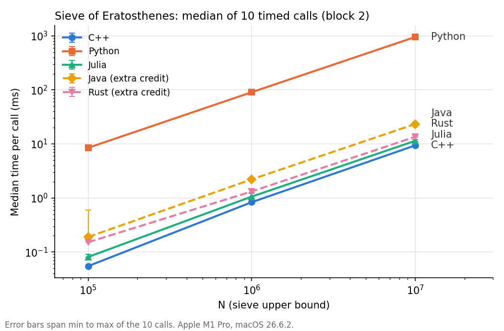

# Lab 1 report: Sieve of Eratosthenes in C++, Python and Julia

## 1. Experimental procedure

### Algorithm

All implementations use the same full sieve. Each call allocates N + 1 one-byte flags set
to 1 and clears the flags for 0 and 1. For each p with p·p ≤ N whose flag is still 1, it clears
p², p² + p, … ≤ N. It then counts the remaining 1-flags with a 64-bit accumulator and returns only
that count. Marking and counting use explicit loops. The flag array is filled in bulk.
The baseline uses no slicing, NumPy, `@inbounds`, `vector<bool>`, `BitArray` or `unsafe`. The
outer bound `p*p <= N` is equivalent to p ≤ ⌊√N⌋ and avoids rounding errors from a floating-point
square root.

### Correctness

Before any timing, every program checks π(N) for N = 2, 10, 100, 10⁵, 10⁶ and 10⁷
against 1, 4, 25, 9 592, 78 498 and 664 579. It also prints the surviving flags for N = 30
(2 3 5 7 11 13 17 19 23 29). All five implementations passed. Every timed call in the CSV
returned the expected count.

### Timing

The timer starts immediately before `count_primes(N)` and stops immediately after
it returns. The timed interval covers allocation, initialization, marking and counting. The count
is stored and printed after the timer stops. Printing, CSV output, checks and warm-up calls are
outside the timed interval. Timers: `steady_clock` (C++), `perf_counter` (Python), `time_ns`
(Julia), `nanoTime` (Java), `Instant` (Rust). For each N, each program makes W untimed warm-up
calls and then 10 timed calls in the same process. All runs used batch size 1. The shortest call
(C++, N = 10⁵, about 0.05 ms) is still more than 1000 ticks of the ~42 ns macOS clock.

### Measurement blocks

Block 1 used W = 5. Its Rust N = 10⁶ sequence trended downward, from 1.71 to 1.51 ms, so I
repeated the complete measurement for all languages with W = 20 (block 2). Block 2 is the reported
block. Block 1 is kept in the CSV and marked `superseded`, and its medians appear in the last
column of the table.

### Environment

Apple M1 Pro, 16 GB RAM, macOS 26.6.2,
on battery with Low Power Mode off. Benchmarks ran one at a time with no other heavy workload.
Toolchains: Apple clang 21.0.0 with `-O3 -std=c++17`, CPython 3.14.2, Julia 1.13.1 (default
options). The README lists the exact commands.

## 2. Results (block 2, W = 20, 10 timed calls each)

Slowdown = median ÷ smallest median among C++, Python and Julia at that N. C++ was the reference
at every N.

| Language | N | Median (ms) | Min (ms) | Max (ms) | π(N) | Slowdown | Block-1 median (ms) |
|---|---:|---:|---:|---:|---:|---:|---:|
| C++ | 10⁵ | 0.0549 | 0.0547 | 0.0555 | 9,592 | 1.00 | 0.0380 |
| Python | 10⁵ | 8.48 | 8.43 | 8.87 | 9,592 | 154.7 | 8.39 |
| Julia | 10⁵ | 0.0810 | 0.0796 | 0.0910 | 9,592 | 1.48 | 0.0817 |
| C++ | 10⁶ | 0.835 | 0.834 | 0.946 | 78,498 | 1.00 | 0.716 |
| Python | 10⁶ | 90.7 | 90.4 | 91.5 | 78,498 | 108.7 | 90.0 |
| Julia | 10⁶ | 1.06 | 1.02 | 1.21 | 78,498 | 1.27 | 0.992 |
| C++ | 10⁷ | 9.38 | 9.24 | 10.09 | 664,579 | 1.00 | 10.91 |
| Python | 10⁷ | 953.5 | 948.2 | 958.2 | 664,579 | 101.7 | 949.4 |
| Julia | 10⁷ | 11.42 | 11.14 | 12.01 | 664,579 | 1.22 | 11.01 |

*Log-log axes. The marker is the median of 10 calls. Error bars run from the minimum to the maximum of those
10 calls and are mostly smaller than the markers. The Java and Rust rows are discussed in the
appendix.*

## 3. Analysis

### Q1. Fastest and slowest

C++ had the lowest median at every N. Python had the highest median
at every N: 155×, 109× and 102× the C++ median at 10⁵, 10⁶ and 10⁷. This gap is two orders of
magnitude larger than any spread I observed, so the result is convincing. The C++ vs Julia gap is
much less certain. In block 2 Julia is 1.48×, 1.27× and 1.22× slower. But the same C++ binary
shifted between blocks: its block-2 medians were 44 % and 17 % higher
at 10⁵ and 10⁶ and 14 % lower at 10⁷ than in block 1. In block 1 the two were nearly tied at N = 10⁷ (10.91 vs 11.01 ms). Within a block the range from minimum to maximum is small (often < 2 %), but the
block-to-block variation is larger. For N ≥ 10⁶ the C++/Julia difference (20 to 30 %) is about the
same size as that between-block variation, so I do not consider it established. At N = 10⁵ C++ was
ahead in both blocks (2.2× and 1.5×). That ordering is plausible, but the size of the factor is not
stable.

### Q2. Explanations

Some explanations are supported by the measurements. CPython's ~100× slowdown matches
interpreter overhead per element. Each `flags[m] = 0`, `m += p` and `count += flags[k]` is executed
as several bytecodes on boxed integers. Python's time grows almost exactly with the operation count
(see Q4), which fits a cost that is fixed per operation and does not depend on memory. Julia's
first call includes JIT compilation, so excluding warm-up changes its result (Q3). Julia's later
calls are flat, which shows that compilation is not part of the steady-state numbers.

The rest are hypotheses that I did not test. Julia keeps bounds checks (no `@inbounds`), and these may block SIMD
vectorization of the counting loop. clang at `-O3` can vectorize the fill and count loops, which
would explain the larger C++ lead at small N, where those linear passes are a bigger share of the
work. The between-block shifts may come from allocator behaviour: a fresh 10 MB array may be served
by new `mmap` pages that must be zero-faulted, or by a reused region. They may also come from the
OS moving the process between performance and efficiency cores. I did not measure page faults, core
placement or generated assembly.

### Q3. Julia's first call

Julia compiles `count_primes(::Int)` to native code on its first call.
That compile time is a one-off cost that is unrelated to the sieve's per-call cost. Including it
would mostly measure Julia's compiler. Startup and
compilation time do matter to a real user who runs a short script once, uses a command-line tool,
or works interactively. In those cases time-to-first-result dominates, and a 10 ms computation
behind about a second of startup favours an ahead-of-time-compiled binary.

### Q4. Tenfold N

The expected work is N log log N, so a tenfold increase in N should multiply the
time by about 10.7 from 10⁵ to 10⁶ and about 10.6 from 10⁶ to 10⁷. The measured ratios were:

| | 10⁵→10⁶ | 10⁶→10⁷ |
|---|---:|---:|
| C++ | 15.2 | 11.2 |
| Python | 10.7 | 10.5 |
| Julia | 13.1 | 10.8 |

Python matches the prediction almost exactly. The compiled implementations grow faster than
predicted between 10⁵ and 10⁶. One possible hardware explanation, which I did not measure, is that the
10⁵-byte array (about 98 KB) fits in the M1 Pro's 128 KB L1 data cache. At 10⁶ (about 1 MB) and
10⁷ (about 10 MB) the array spills to L2 or beyond, and strided marking with large p touches a new
cache line on almost every store. Python is so slow per element that memory latency stays hidden.

### Q5. One-byte flags

Fixing the element size removes data representation as a variable, so differences between the
languages cannot come from different storage layouts. Storage is N + 1 bytes:
about 10 MB at N = 10⁷ and 100 MB at N = 10⁸. Packed bits (`vector<bool>`, `BitArray`) need
⅛ of that (1.25 MB and 12.5 MB). That improves cache fit but adds shift and mask work to every
access, so it could make one language faster or slower for reasons unrelated to the language. A
Python list stores an 8-byte pointer per element (about 80 MB and 800 MB, plus the list object).
It would increase memory traffic and make Python's numbers incomparable to the others.

### Q6. Generalizing

The ratios would not necessarily carry over, because this benchmark measures one integer-only,
memory-bound kernel with simple loops. Matrix multiplication is dominated by BLAS libraries, which all three languages call,
so the ratios could collapse to about 1. Floating-point simulations depend on vectorization and
math libraries. String processing depends on the string representation and its library. File I/O is
limited by the OS and the storage device. More evidence would need several kernels, several input
sizes and representations, other CPUs and compilers, repeated independent process launches, and
hardware counters (`perf`/Instruments) to test the cache and vectorization hypotheses.

### Q7. When to use each

I would choose C++ for latency-critical or embedded code, for existing C++ codebases, and where the
deployment target cannot carry a runtime. It takes the most development effort. I would choose
Julia for numerical and scientific work where loop-heavy code must be fast without moving to
another language. Here it came within about 1.2 to 1.5× of C++ with ordinary loops. Its costs are
compilation latency and a smaller ecosystem. I would choose Python for prototyping, orchestration
and data handling. It has the largest library ecosystem, and NumPy or compiled extensions remove most of
the interpreter overhead measured here. Explicit Python loops like this baseline should not be on
a hot path.

## 4. Limitations

- One machine (Apple M1 Pro) and one compiler or runtime version per language. The rankings may
  not hold on x86 or with GCC.
- Each block ran once per language, in a fixed order (C++, Python, Julia, Java, Rust). Block-to-block
  shifts of up to 44 % show that 10 runs in one process understate the real variability.
  Several independent process launches would give a better estimate.
- Both blocks ran on battery. Power and thermal conditions were similar, but CPU frequency and core
  placement were not controlled or recorded.
- The cache, vectorization, bounds-check and allocator explanations are hypotheses. I did not
  inspect assembly or collect hardware counters.

## Appendix: extra credit (Java and Rust)

Both use the same algorithm, sizes, timing boundary and protocol. Java uses `byte[]` with a `long`
accumulator, OpenJDK 27 with default options, and warm-up in the same JVM. Rust uses `Vec<u8>`,
`u64`, safe indexing, and `cargo build --release` (opt-level 3). Both passed all correctness
checks. Slowdown uses the same C++ reference.

| Language | N | Median (ms) | Min (ms) | Max (ms) | π(N) | Slowdown | Block-1 median (ms) |
|---|---:|---:|---:|---:|---:|---:|---:|
| Java | 10⁵ | 0.190 | 0.189 | 0.591 | 9,592 | 3.45 | 0.196 |
| Java | 10⁶ | 2.21 | 2.19 | 2.32 | 78,498 | 2.65 | 2.14 |
| Java | 10⁷ | 23.3 | 23.1 | 24.1 | 664,579 | 2.49 | 23.6 |
| Rust | 10⁵ | 0.152 | 0.152 | 0.162 | 9,592 | 2.77 | 0.152 |
| Rust | 10⁶ | 1.32 | 1.28 | 1.41 | 78,498 | 1.58 | 1.54 |
| Rust | 10⁷ | 13.6 | 13.4 | 14.1 | 664,579 | 1.45 | 13.4 |

### Java

Java was the slowest of the compiled implementations, at about 2.5 to 3.5× the C++
median. Its medians matched across blocks to within 4 %, so W = 5 and W = 20 gave the same steady
state. The 0.59 ms maximum at N = 10⁵ is the first timed call of block 2, about 3× the median. That
is consistent with a JIT tier transition or a GC pause, but I did not enable `-Xlog:gc` or
`-XX:+PrintCompilation`, so I cannot tell which. The measurements show that Java's per-call cost is stable after
warm-up. They do not show how much time went to compilation, garbage collection or zeroing the `byte[]` (the JVM zeroes it, then `Arrays.fill` writes it again). They
also do not show whether different JVM flags or a longer warm-up would change the ranking.

### Rust vs C++

Rust was 2.8× slower than C++ at N = 10⁵. The gap shrank to 1.6× and then 1.45×
as N grew. Rust's N = 10⁶ timings kept drifting downward even with W = 20, from 1.41 to 1.28 ms. Rust is
compiled ahead of time, so this is not JIT warm-up. Allocator, page or frequency effects are more
likely, but that is a hypothesis. Both use LLVM at opt-level 3, but Rust's indexing is
bounds-checked. The counting loop also iterates over a `0..=n` inclusive range, which LLVM often
vectorizes less well than a half-open range. Either difference could explain the larger gap at
small N, where linear passes dominate. These measurements do not isolate the cost of safety.
That would require a controlled change of one factor at a time (for example `0..flags.len()`, or
iterating over `flags.iter()`) and inspecting the generated code, which I did not do.
